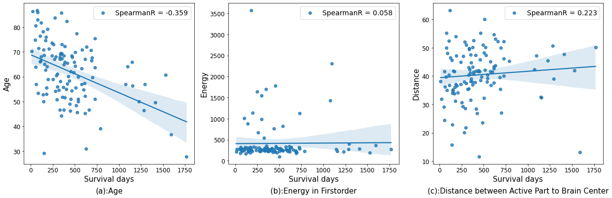

# Brain Tumor Challenge: Survival Prediction

In this project, we aim to predict the survival of patients with brain tumors using machine learning techniques.

## Dataset

We used the dataset from the challenge BraTS 2020 (https://www.med.upenn.edu/cbica/brats2020/data.html), it has both segmentation and survival prediction task inside. 

***Segmentation***: The dataset contains several model scans with NIFTI files (.nii.gz) and describe a) native(**T1**) and b) post-contrast T1-weighted (**T1Gd**), c) T2-weighted (**T2**), and d) T2 Fluid Attenuated Inversion Recovery (**T2-FLAIR**) volumns. All the imaging datasets have been segmented manually.

***Survival***: The overall survival (OS) data, defined in days, are included in a comma-separated value (.csv) file with correspondences to the pseudo-identifiers of the imaging data. The .csv file also includes the age of patients, as well as the resection status.

## Features Extraction

Correct extraction of features is the basis for accurate prediction. We used two different methods to extract the features:

***PyRadiomics***: PyRadiomics is a package which can automatically extract radiomics features in medical images. The lack of standardization of feature definitions has been shown to have a substantial impart on the reliability of radiomic data and this package was designed to solve it. The features extracted with it could be divided into 7 different categories: the distribution of voxel intensities (First Order), 3D features of size and shape (Shape Features), gray level co-occurrence matrix features (GLCM), gray level size zone matrix (GLSZM), gray level run length matrix features (GLRLM), neighbouring gray tone difference matrix features (NGTDM) and gray level dependence matrix features (GLDM).

***Radiomic features***: On the other hands, we take the volumn ratio of necrosis, edema and active tumor relative to the whole brain, the position from the center of the brain and their relative coordinates to the center of the brain were selected respectively. In addition, we also added the parameters of tumor's surface. We think that the uneven surface would increase the difficulty of the operation and affect the survival time of the patient.

## Features Selection

After combining the extracted features based on radiomics and the manual defined method, there were 126 features for one single case. Many of them actually didn’t have high relationship with the survival days, most of them were just noise in the final regression. We used the SpearmanR to show the relationship between the features and survival day. Set a threshold to choose the parameter and lower the outliers.

## Results

We will evaluate the performance of our models using various metrics such as accuracy, precision, recall, and area under the receiver operating characteristic (ROC) curve. We will also compare our models with the baseline models provided by the Brain Tumor Challenge.

## Conclusion

The ability to accurately predict the survival of patients with brain tumors can have a significant impact on their treatment and care. By applying machine learning techniques to the Brain Tumor Challenge dataset, we hope to contribute to the development of more effective and personalized treatments for patients with glioblastoma multiforme.
